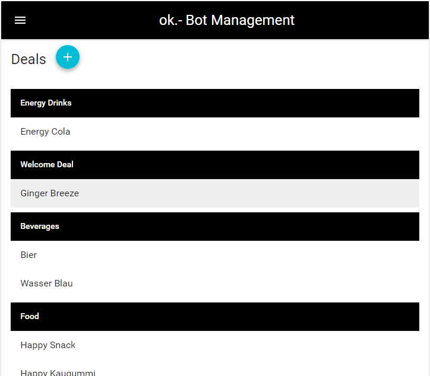
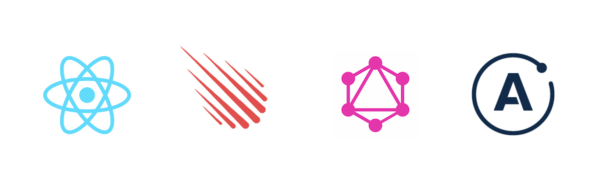

# Apometact

This is a Apollo, Meteor and React example app.  
It is the backend application for this chatbot: [ok Chatbot](https://github.com/janikvonrotz/ok-chatbot)  
Blog post: [Graphql with Apollo, Meteor and React](https://janikvonrotz.ch/2016/10/09/graphql-with-apollo-meteor-and-react/)

The application:



The magic:



- Build system > Meteor
- Graphql client > React and Apollo
- Graphql server > Express and Apollo

Run with:

- Install Meteor
- Clone this repo and install dependencies with `npm install`
- Copy `configuration-template.json` to `development.json` and update it
- Run with `npm run dev`

What you get:

- Graphql api running on http://localhost:3000/graphql
- Graphql query editor on: http://localhost:3000/graphiql
- React client app on: http://localhost:3000

## FAQ

Why Meteor as a build system?

> Ever tried to run a client and server app with node, babel, webpack and live reload in a development environment? Seppuku!

## Queries

A list of Graphql queries and mutators.

### Deals

```
{
  deals {
    id
    title
    imageUrl
    pointOfSale
    description
    expiresAt
    createdAt
  }
}

mutation {
  createDeal(title: "Energy Drink Test") {
    id
  }
}

mutation {
  createDeal(title: "Energy Drink Test", description: "2 für 8", productDetails: "250 ml", itemUrl: "http://www.okpunktstrich.ch/de/", imageUrl: "https://s3.amazonaws.com/valora/energy+drink+resealable.jpg", qrImageUrl: "https://s3.amazonaws.com/valora/energy+drink+qr.png", pointOfSale: ["KKiosk", "Avec"], categoryId: "", publishAt: "2016-09-28T22:11:53.158Z", expiresAt: "2016-10-28T22:11:53.158Z", createdAt: "2016-09-28T22:11:53.158Z") {
    id
  }
}

mutation {
  updateDeal(id: "57ed95d231155e0ba0eab8a3", title: "new title")
}

mutation {
  deleteDeal(id: "57ec46867c590b11c8d03100")
}
```

### Categories

```
mutation{
  createCategory(label: "Hello World") {
    id
  }
}

mutation {
  updateCategory(id: "57ed90f030387b0a0c2d2448", label: "New Title")
}

mutation {
  deleteCategory(id: "57ed90f030387b0a0c2d2448")
}


```

## Resources

[How to build a GraphQL server](https://medium.com/apollo-stack/tutorial-building-a-graphql-server-cddaa023c035#.nbab6cbij)

[GraphQL cheat sheet](https://raw.githubusercontent.com/sogko/graphql-shorthand-notation-cheat-sheet/master/graphql-shorthand-notation-cheat-sheet.png)

[Apollo server docs](http://dev.apollodata.com/tools/)

[Apollo react client docs](http://dev.apollodata.com/react/)  

[Outdated but useful example of Meteor integration](https://github.com/apollostack/apollo-meteor-discourse-example/blob/master/imports/ui/index.js)
